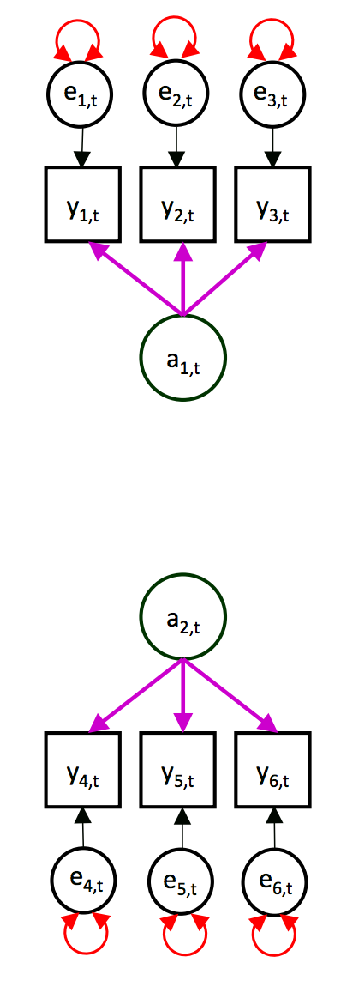
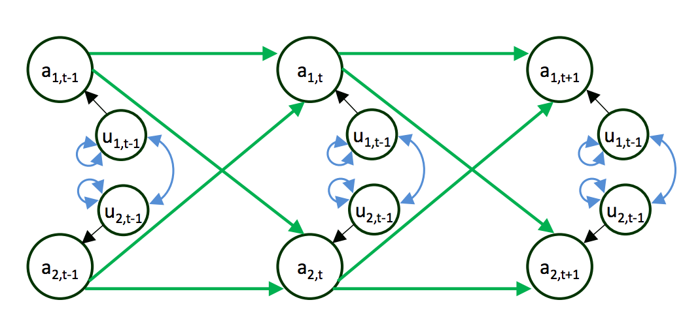
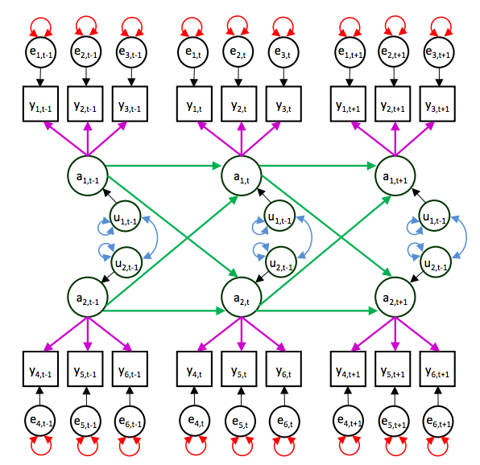

```{r knitr_init, echo=FALSE, cache=FALSE}
library(knitr)
library(rmdformats)

## Global options
options(max.print="75")
opts_chunk$set(echo=FALSE,
	             cache=TRUE,
               prompt=FALSE,
               tidy=TRUE,
               comment=NA,
               message=FALSE,
               warning=FALSE)
opts_knit$set(width=75)
```


# はじめに

- [Stan Advent Calender 2017](https://qiita.com/advent-calendar/2017/stan)5日目の記事です。
- 構造方程式モデリングを使って, 時系列データを扱うことをD-SEM (Dynamic SEM)と呼びます。
- ここでは、D-SEMを使って階層ベイズモデルが実行可能な[ctsem](https://github.com/cdriveraus/ctsem)を紹介します。


# 時系列データのモデル

## ベクトル自己回帰の問題：時間の扱い

心理学では1つの変数の推移を記述, 予測することよりも, ある変数の変化がどのような変数で説明されるかといった形式で, 2つ以上の変数の関係を明らかにすることに関心がある場合が多いです。

時系列データで複数の変数間の扱うモデルは種々ありますが, その代表として, ベクトル自己回帰モデルがあります。ベクトル自己回帰モデルでは, 時間を離散値,等間隔のものとする仮定が置かれていて, この仮定を逸脱した場合には, 推定にバイアスが生じることが知られています。   

最近, 心理学の中では, 経験サンプリング法のように, 個人に対して高い頻度で繰り返し測定可能な測定手法を用いた研究が注目を集めてます。このような手法で調査をする場合に,得られるデータは, 個々人の回答する間隔が等間隔ではなく, 個人によってまちまちであることが少なくありません。　このようなデータでベクトル自己回帰を適用すると, 先述した仮定からの逸脱によってバイアスが生じやすくなります。

ベクトル自己回帰における時間の仮定 (等間隔, 離散型)から抜け出すために,時間の連続性を仮定したモデルの有用性が指摘されています。 連続時間のモデルには, 確率微分方程式(stochastic differential equation)が用いられ, それを構造方程式モデリングの枠組みで推定を行うのが, ctsemパッケージとなります。


## 連続時間のダイナミックモデル

### 個人レベルのダイナミックモデル

下記の確率微分方程式で示されます。

$d\eta(t)=(A\eta(t)+b+Mx(t))dt+GdW(t)$  

> ベクトル$\eta(t)$:  時点$t$の潜在過程における状態  
> 行列$A$:  ドリフト行列, 対角要素が自己回帰係数と非対角要素が遅延交差係数の行列  
> ベクトル$b$:  連続時間の切片   
> $x(t)$:  時間依存共変量  
> $W(t)$:  ウェーナープロセス  
> $Q=GG^T$:  $G$はディフュージョンプロセスの分散共分散行列  


先の微分方程式は、離散時間$u$のモデルに変換されます。

$eta(u)=(A_u\eta_{u-1}+b+Mx(u)+\zeta_u$    
$\zeta_u\sim N(0_v,Q_u)$     

ただし, 連続時間として扱うために$A_u$, $b_u$,$Q_u$は,下記に従います。

> $A_u=e^{A(t_u-t_{u-1})}$  
> $b_u=A^{-1}(A_u-I)b$
> $Q_u=Q_\infty-A_uQ_\infty(A_u)^T$  


### 個人レベルの測定モデル

$y(t) = \Lambda\eta(t)+\tau+\epsilon(t)$  
$\epsilon(t) = N(0_c, \Theta)$

> $y(t)$: 観測変数のベクトル  
> $\Lambda$: 因子負荷  
> $\tau$: 切片  
> $\epsilon$: 残差ベクトル, 共分散行列  


### 集団レベル

$p(\Phi,\mu,R,\beta|Y,Z)=\frac{p(Y|\Phi)p(\Phi|\mu,R,\beta,Z)^(\mu,R,\beta)}{p(Y)}$  

$\Phi_i = tform(\mu+Rh_i+\beta_{z_i})$  
$h_i \sim N(0,1)$  
$\mu \sim N(0,1)$  
$\beta \sim N(0,1)$  

> $\Phi_i$: 個レベルのモデルの全パラメータ (ダイナミックモデルと測定モデル)  
> $\mu$: 個人レベルのモデルのパラメータ分布の母平均  
> $R$: 集団の共分散行列のコレスキー因子  
> $h_i$: 個人specificな偏差  
> $z_i$:時間非依存の共変量の効果  

$tform$と書かれているように, 集団レベルの各パメータは, パラメータ境界, 前提となる分布, 固定するパラメタ, 解釈の容易さ, サンプリングの効率, といった観点から, 制約や変換が必要になります。ここが極めて重要なのですが, 十分に追えなかったので, 詳細は, [こちら](https://www.researchgate.net/publication/310747801_Hierarchical_Bayesian_Continuous_Time_Dynamic_Modeling)を参照ください。


## SEMで理解する


今回のアドカレでは状態-空間モデルが大人気です。5つの記事があがっています。

1. [状態空間モデルにはどれほどデータが必要か](http://kosugitti.net/archives/6014)  
2. [二階差分の状態空間モデル，それより俺はいつからデブキャラになったんだ](http://kosugitti.net/archives/6044)  
3. [一般化極値分布の実装と状態空間モデルによる高松市の最大降水量の推移](http://mtokuoka.net/2017/12/10/gev_and_ss_model/)  
4. [電気の使用量の季節変動を推定してみました](http://g01beza.blog40.fc2.com/blog-entry-1.html)  
5. [Vector Auto-Regressive Bayesian Dynamic Model (VAR-BDM) による情動ダイナミクスの解析](https://qiita.com/NSushi/items/eefee2c83c5696bafa5a)  


状態空間モデルを構造方程式モデルでパス図と共に理解すると, 先のセクションで説明した今回扱うモデルが一歩理解しやすくなると思います。

[Mplus開発チームのスライド](https://modeling.uconn.edu/wp-content/uploads/sites/1188/2016/05/HAMAKER-COMBINED2.pdf)がとてもわかりやすいです。スライド40〜43をご覧ください。


状態空間モデルは, 測定方程式と移行方程式で表現されます。

### 測定方程式= 因子分析モデル

$y_t = c_t + \color{violet}Z_t a_t + e_t$  
$e_t ∼ MN(0, \color{red}G\color{red}G_t)$

$c_t$は測定方程式の切片ベクトル  
$\color{violet}Z_t$は因子負荷行列  
$\color{red}G\color{red}G_t$は測定誤差の共分散行列  

上記は先のセクションの測定モデルと対応します。

パス図で表現すると,式の色と図の色が対応しています。  
[Mplusチームスライド41枚目](https://modeling.uconn.edu/wp-content/uploads/sites/1188/2016/05/HAMAKER-COMBINED2.pdf)

{heigt=30%}


### 移行方程式 = 因子の自己回帰と交差回帰

$a_t = d_t + \color{green}T_t a_{t-1}+u_t$  
$u_t ∼ MN(0, \color{blue}H\color{blue}H_t)$  


$d_t$は移行方程式の切片ベクトル  
$\color{green}T_t$は自己回帰係数とクロス回帰係数の行列  
$\color{blue}H\color{blue}H_t$は測定誤差のダイナミック誤差  


上記は先のセクションのダイナミックモデルと対応します。

$\color{green}T_t$がドリフト行列  
$\color{blue}H\color{blue}H_t$がディフージョン行列  

と対応しているわけです。

こちらもパス図で表現すると,式の色と図の色が対応しています。  

[Mplusチームスライド42枚目](https://modeling.uconn.edu/wp-content/uploads/sites/1188/2016/05/HAMAKER-COMBINED2.pdf)


二つの方程式を同時に表現したものが以下です。
[Mplusチームスライド43枚目](https://modeling.uconn.edu/wp-content/uploads/sites/1188/2016/05/HAMAKER-COMBINED2.pdf)  


つまり, 
測定方程式では, ある概念を測定する複数の項目から測定誤差を切り離して綺麗な得点にして(因子得点), 移行方程式でその綺麗な得点を使って、ベクトル自己回帰モデルをするモデルになっています。

状態-空間モデルと構造方程式モデルに異同に関しては[こちら](https://www.researchgate.net/publication/44132210_Equivalence_and_Differences_Between_Structural_Equation_Modeling_and_State-Space_Modeling_Techniques)が参考になるようです。


# ctsemパッケージ
開発者は,マックスプランク研究所の[Charlees Driver](https://www.researchgate.net/profile/Charles_Driver)。イケメンです。  


- 最尤推定, ベイズ推定が実行可能です。
- 最尤推定は, 裏でOpenMXを使っています。
- ベイズ推定は, Stanを使っています。

今回は, ctsemパッケージを使ってD-SEMのベイズ推定を実行をする方法を紹介します。


## パッケージのインストールとロード

パッケージはCRANにあります。

```{r, echo=T, eval=F}
install.packages("ctsem")
```


## 使用するデータ

ctsemパッケージに内包されている, ベイズ推定練習用のデータセットctstantestdatを使います。
1人につき50時点, 5名分のデータがlong型で入っています。

- id: 個人識別番号(1から順に入れる必要あり)
- time: 時間変数
- Y1: 観測変数1
- Y2: 観測変数2
- TD1: 時間依存共変量 (時点ごとに変化)
- TI1: 時間非依存共変量 (時点ごとに不変)


```{r,echo=T}
library(ctsem)
data(ctstantestdat)
DT::datatable(ctstantestdat) 
```


## continuous-time dyanamic modelのStanモデルを生成

ctsemのctModel関数で, 推定モデルを指定します。

- n.latent: 潜在変数の数
- latentNames: 潜在変数の変数名(任意)
- n.manifest: 観測変数の数
- manifestNames: 観測変数の変数名(データセットと対応)
- n.TDpred: 時間依存共変量の数
- TDpredNames: 時間依存共変量の変数名(データセットと対応)
- n.TIpred: 時間非依存共変量の数
- TIpredNames: 時間非依存共変量の変数名(データセットと対応)
- LAMBDA: 潜在変数行列


```{r, echo=T}
model<-ctModel(type='stanct', 
               n.latent=2, latentNames=c('eta1','eta2'), 
               n.manifest=2, manifestNames=c('Y1','Y2'), 
               n.TDpred=1, TDpredNames='TD1',  
               n.TIpred=3, TIpredNames=c('TI1','TI2','TI3'),
               LAMBDA=diag(2))
```

観測変数の平均を除いて全てのパラメータを参加者間で固定します。
ここを固定しなければ,　個人ごとに異なるモデルが指定できます。


```{r, echo=T}
model$pars$indvarying[-c(19,20)] <- FALSE
```

## Stanモデルの実行
ctsemのStanFit関数を使って, Stanでモデルの推定を行います。
今回のセッティングでは, 30分程度かかります。

- dat: データセット
- ctstanmodel: ctmodelで指定したモデル
- iter: Stanのiteration
- chain: mcmcのchain数

間引きのthinなど, mcmcのセッティングでStanで使用可能なものは,もちろん使えます。
iterは極端に小さくしています(時間節約)。


```{r, echo=T, eval=F}
fit<-ctStanFit(dat=ctstantestdat, ctstanmodel=model, 
               iter=600, chains=4, 
               control=list(max_treedepth=6))
```

```{r,echo=F}
load("stanfit.Rdata")
load("stanfit2.Rdata")
```

## 結果の出力
そのまま, summary関数を使っても良いですし,stan慣れしている人は, 
stanfitが直で格納されいるので,そこから自分の好きなようにアウトプットを整えても良いです。

```{r, echo=T}
res.stan<-fit$stanfit
fit2<-fit$ctstanmodel
```


## 推定されるパラメータ

集団レベルのパラメータはpopmeansに格納されています

```{r, echo=T}
stanfit$popmeans
```


T0mean_変数1: T1の変数1の平均   
T0mean_変数2: T1の変数2の平均   

drift_変数1_変数1: 変数1の自己回帰  
drift_変数1_変数2: 変数1から変数2へのクロス回帰  
drift_変数2_変数2: 変数2の自己回帰  
drift_変数2_変数1: 変数2から1へのクロス回帰  

diffusion_変数1_変数1: 変数1の分散  
diffusion_変数2_変数1: 変数1と2の共分散  
diffusion_変数2_変数2: 変数2の分散  
    
manifestvar_変数1_変数1: 観測変数1の誤差分散  
manifestvar_変数2_変数2: 観測変数2の誤差分散  
manifestmean_変数1: 観測変数1の平均  
manifestmean_変数2: 観測変数2の平均  
  
T0var_変数1_変数1: T1の変数1の分散  
T0var_変数2_変数1: T1の変数2と変数1の共分散   
T0var_変数2_変数2: T1の変数2の分散   


## 色々なプロット
typeを指定することで, 各種プロットが出力されます。


>  type="regression"

自己回帰係数と,交差回帰係数の経時的な変化がプロットされます。
自己回帰はどちらも(eta2_eta2とeta1_eta1), 経時的に減少し,  
変数1から変数2への係数(eta1_eta2)はほぼゼロで推移し,  
変数2から変数1への係数(eta2_eta1)が一定の効果を維持していことがわかります。

```{r, echo=T}
plot(fit,type="regression")
```


> type=" kalman"

kalman filterを使って, 今回のモデルからの予測区間をプロットしてくれます。

```{r, echo=T}
plot(fit,type="kalman")
```


> type="priorcheck"

各パラメータの事前分布と事後分布を一気に出力してくれます。

```{r, echo=T}
plot(fit,type="priorcheck")
```


> type="priorcheck"

各パラメータのトレースプロットを出力してくれます。

```{r, echo=T}
plot(fit,type="trace")
```


> type="priorcheck"

各パラメータの事後分布を出力してくれます。

```{r, echo=T}
plot(fit,type="density")
```

> type="intervals"

各パラメータの事後分布の確信区間を出力してくれます。

```{r, echo=T}
plot(fit,type="intervals")
```


# Stan codeを取り出す

```{r, echo=T, eval=F}
stanmodelcode<-fit$stanmodeltext
```


コードの詳細を確認するまでの時間と知識とガッツが総じて足りませんでした。という訳で今回はパッケージ紹介まで。ctModelで, 色々なモデルを試してStan codeを眺めて見ると,理解が進みそうです。これでDamped Oscillater Modelの推定もできるようで, そこまで自由に扱えるなりたいです。

Enjoy RStan with ctsem !!


```
functions{

matrix matrix_diagexp(matrix in){
matrix[rows(in),rows(in)] out;
for(i in 1:rows(in)){
for(j in 1:rows(in)){
if(i==j) out[i,i] = exp(in[i,i]);
if(i!=j) out[i,j] = 0;
}}
return out;
}

matrix trisolve(matrix l, int unitdiag){ //inverse of triangular matrix
  matrix[rows(l),rows(l)] b ;
  matrix[rows(l),rows(l)] x;
  x = diag_matrix(rep_vector(1,rows(l)));
  b = x;

    for(j in 1:cols(x)){
      if(unitdiag != 1) x[j,j] = b[j,j] / l[1,1];
      
     if(rows(x)>1){
      for(m in 2:rows(x)){
      x[m,j]  =  (b[m,j] - (l[m,1:(m-1)] * x[1:(m-1),j]) ) / l[m,m];
      }
     }
    }
  return x;
}

matrix inverse_sym(matrix a){ // use ldlt decomposition to decompose symmetric non-definite matrices
  matrix[rows(a),rows(a)] d;
  matrix[rows(a),rows(a)] l;

  d=diag_matrix(rep_vector(0,rows(a)));
  l=diag_matrix(rep_vector(1,rows(a)));
  
  for(j in 1:rows(a)){
    for(i in (min(j+1,rows(a))):rows(a)){
      
      if(j==1) {
        d[j,j]=a[j,j];
        l[i,j]=1/d[j,j] * a[i,j];
      }
      if(j>1) {
        d[j,j]=a[j,j]- sum( square(l[j, 1:(j-1)]) * d[1:(j-1), 1:(j-1)]);
        if(i > j) l[i,j]=1/d[j,j] * ( a[i,j] - sum(l[i,1:(j-1)] .* l[j,1:(j-1)] * d[1:(j-1),1:(j-1)]));
      }
    }
  }
  l = trisolve(l,0);
  l = l' * diag_matrix(rep_vector(1,rows(d)) ./ diagonal(d)) * l;
  return l;
}


 matrix covchol2corchol(matrix mat, int invert){ //converts from lower partial sd matrix to cor
      matrix[rows(mat),cols(mat)] o;
      vector[rows(mat)] s;
    o=mat;

    for(i in 1:rows(o)){ //set upper tri to lower
for(j in min(i+1,rows(mat)):rows(mat)){
o[j,i] = inv_logit(o[j,i])*2-1;  // can change cor prior here
o[i,j] = o[j,i];
}
      o[i,i]=1; // change to adjust prior for correlations
    }

if(invert==1) o = inverse_sym(o);


  for(i in 1:rows(o)){
      s[i] = inv_sqrt(o[i,] * o[,i]);
    if(is_inf(s[i])) s[i]=0;
    }
      o= diag_pre_multiply(s,o);
return o;
 }

      matrix sdcovchol2cov(matrix mat, int cholesky){ //converts from lower partial sd and diag sd to cov or cholesky cov
      matrix[rows(mat),rows(mat)] out;
      int invert;

invert = 0; //change integer for marginal or partial prior
if(rows(mat) > 1){
      out=covchol2corchol(mat,invert); 
      out= diag_pre_multiply(diagonal(mat), out);
}
if(rows(mat)==1) out[1,1] = mat[1,1];

      if(cholesky==0) out = out * out';
      return(out);
      }
      

      matrix kron_prod(matrix mata, matrix matb){
      int m;
      int p;
      int n;
      int q;
      matrix[rows(mata)*rows(matb),cols(mata)*cols(matb)] C;
      m=rows(mata);
      p=rows(matb);
      n=cols(mata);
      q=cols(matb);
      for (i in 1:m){
      for (j in 1:n){
      for (k in 1:p){
      for (l in 1:q){
      C[p*(i-1)+k,q*(j-1)+l] = mata[i,j]*matb[k,l];
      }
      }
      }
      }
      return C;
      }
      
      matrix makesym(matrix mat){
      matrix[rows(mat),cols(mat)] out;
      out=mat;
      for(rowi in 1:rows(mat)){
      for(coli in 1:cols(mat)){
      if(coli > rowi) {
out[rowi,coli]=mat[coli,rowi] *.5 + mat[rowi,coli] *.5;
out[coli,rowi] = out[rowi,coli];

}
      }
      }
      return out;
      }
      
      matrix cov(vector[] mat,int nrows,int ncols){
      vector[ncols] means;
      matrix[nrows,ncols] centered;
      matrix[ncols,ncols] cov;
      for (coli in 1:ncols){
      means[coli] = mean(mat[,coli]);
      for (rowi in 1:nrows)  {
      centered[rowi,coli] = mat[rowi,coli] - means[coli];
      }
      }
      cov = centered' * centered / (nrows-1);
      return cov; 
      }
      
      real inttoreal(int mynum){
      real out;
      out=mynum;
      return out;
      }


      }
      
      data {
      int<lower=0> ndatapoints;
      int<lower=1> nmanifest;
      int<lower=1> nlatent;
      int<lower=1> nsubjects;
      
      int<lower=0> ntipred; // number of time independent covariates
        matrix[nsubjects,ntipred] tipredsdata;
        int nmissingtipreds;
      
      vector[nmanifest] Y[ndatapoints]; 

      int<lower=0> ntdpred; // number of time dependent covariates
      
      vector[ntdpred] tdpreds[ndatapoints];
      
      vector[ndatapoints] dT; // time intervals
      int driftindex[ndatapoints]; //which discreteDRIFT matrix to use for each time point
      int diffusionindex[ndatapoints]; //which discreteDIFFUSION matrix to use for each time point
      int cintindex[ndatapoints]; //which discreteCINT matrix to use for each time point
      int subject[ndatapoints];
      int<lower=0> nparams;
      int T0check[ndatapoints]; // logical indicating which rows are the first for each subject
      int continuoustime; // logical indicating whether to incorporate timing information
      int nindvarying; // number of subject level parameters that are varying across subjects
      int nindvaryingoffdiagonals; //number of off diagonal parameters needed for hypercov matrix
      int notindvaryingindex[nparams-nindvarying];
      int indvaryingindex[nindvarying];
        vector[nindvarying] sdscale;
      
      
      

      int nt0varstationary;
      int nt0meansstationary;
      int t0varstationary [nt0varstationary, 2];
      int t0meansstationary [nt0meansstationary, 2];
      
      int<lower = 0, upper = nmanifest> nobs_y[ndatapoints];  // number of observed variables per observation
      int<lower = 0, upper = nmanifest> whichobs_y[ndatapoints, nmanifest]; // index of which variables are observed per observation
      int<lower=0,upper=nlatent> ndiffusion; //number of latents involved in covariance calcs
      int<lower=0,upper=nlatent> diffusionindices[ndiffusion]; //index of which latent variables are involved in covariance calculations
      }
      
      transformed data{
      matrix[nlatent,nlatent] IIlatent;
      matrix[nlatent*nlatent,nlatent*nlatent] IIlatent2;
      IIlatent = diag_matrix(rep_vector(1,nlatent));
      IIlatent2 = diag_matrix(rep_vector(1,nlatent*nlatent));
      }
      
      parameters {
      vector[nparams] hypermeans; // population level means 

      
      vector[nindvarying] rawhypersd; //population level std dev
        //cholesky_factor_corr[nindvarying] hypercorrchol; // population level cholesky correlation
        //cov_matrix[nindvarying] wishmat;
        vector[nindvaryingoffdiagonals] sqrtpcov;
        vector[nindvarying*nsubjects] indparamsbase; //subject level parameters
        
      
      
        vector[45] tipredeffectparams; // effects of time independent covariates
        vector[nmissingtipreds] tipredsimputed; 

      
      
      
      
      }
      
      transformed parameters{
      


      vector[nindvarying] indparams[nsubjects]; 
       vector[nindvarying] hypersd; //population level std dev
        matrix[nindvarying,nindvarying] sqrtpcovmat;
        matrix[nindvarying,nindvarying] hypercorrchol;
        matrix[nindvarying,nindvarying] hypercovchol; 
        
      
      matrix[nlatent,nlatent] DIFFUSION[1]; //additive latent process variance
      matrix[nlatent,nlatent] T0VAR[1]; //initial latent process variance
      
      matrix[nlatent,nlatent] DRIFT[1]; //dynamic relationships of processes
      matrix[nmanifest,nmanifest] MANIFESTVAR[1]; // manifest error variance
      vector[nmanifest] MANIFESTMEANS[nsubjects];
      vector[nlatent] T0MEANS[1]; // initial (T0) latent states
      matrix[nmanifest,nlatent] LAMBDA[1]; // loading matrix
      vector[nlatent] CINT[1]; // latent process intercept
      
      matrix[ndiffusion,ndiffusion] asymDIFFUSION[1]; //latent process variance as time interval goes to inf
      
      matrix[nlatent,ntdpred] TDPREDEFFECT[1]; // effect of time dependent predictors
      
        matrix[2,3] tipredeffect; //design matrix of individual time independent predictor effects
        matrix[nsubjects,ntipred] tipreds; //tipred values to fill from data and, when needed, imputation vector
      
      
    {
      int counter;
      counter = 0;
      for(rowi in 1:rows(tipreds)){
        for(coli in 1:cols(tipreds)){
          if(tipredsdata[rowi,coli]==99999) {
            counter = counter + 1;
            tipreds[rowi,coli] = tipredsimputed[counter];
          } else tipreds[rowi,coli] = tipredsdata[rowi,coli];
        }
      }
    }
       tipredeffect[1, 1] = tipredeffectparams[1]; 
  tipredeffect[1, 2] = tipredeffectparams[2]; 
  tipredeffect[1, 3] = tipredeffectparams[3]; 
  tipredeffect[2, 1] = tipredeffectparams[4]; 
  tipredeffect[2, 2] = tipredeffectparams[5]; 
  tipredeffect[2, 3] = tipredeffectparams[6]; 
 

  

      
      
        hypersd = exp(rawhypersd * 2 ) .* sdscale;


if(nindvarying > 0){
{
int counter;
sqrtpcovmat=diag_matrix(rep_vector(-99,nindvarying));
if(nindvarying > 1){
counter=0;
        for(j in 1:(nindvarying-1)){
        for(i in (j+1):nindvarying){
counter=counter+1;
        sqrtpcovmat[i,j]=sqrtpcov[counter];
        }}
}
}

if(nindvarying > 1) hypercorrchol = covchol2corchol(sqrtpcovmat,0); //change int to change from partial to marginal prior
}


if(nindvarying ==1) hypercorrchol = diag_matrix(rep_vector(1,1));


        hypercovchol= diag_pre_multiply(hypersd, hypercorrchol);  
        
        for(subi in 1:nsubjects) {
        indparams[subi]= 
        hypercovchol * indparamsbase[(1+(subi-1)*nindvarying):(subi*nindvarying)] +hypermeans[indvaryingindex] + tipredeffect * tipreds[subi]' ;  
        }
        
        
      
      {
      vector[ndiffusion*ndiffusion] asymDIFFUSIONvec[1];
      matrix[ndiffusion*ndiffusion,ndiffusion*ndiffusion] DRIFTHATCH[1];
      
      // create subject specific parameter matrices from fixed and transformed free effects 
      T0MEANS[1][1] = ((hypermeans[1])) * 10; 
T0MEANS[1][2] = ((hypermeans[2])) * 10; 
LAMBDA[1][1 , 1] = 1; 
LAMBDA[1][1 , 2] = 0; 
LAMBDA[1][2 , 1] = 0; 
LAMBDA[1][2 , 2] = 1; 
DRIFT[1][1 , 1] = -log(exp(-(hypermeans[3])*1.5)+1)-.00001; 
DRIFT[1][1 , 2] = ((hypermeans[4])); 
DRIFT[1][2 , 1] = ((hypermeans[5])); 
DRIFT[1][2 , 2] = -log(exp(-(hypermeans[6])*1.5)+1)-.00001; 
DIFFUSION[1][1 , 1] = exp((hypermeans[7])*2); 
DIFFUSION[1][1 , 2] = 0; 
DIFFUSION[1][2 , 1] = ((hypermeans[8])); 
DIFFUSION[1][2 , 2] = exp((hypermeans[9])*2); 
MANIFESTVAR[1][1 , 1] = exp((hypermeans[10])); 
MANIFESTVAR[1][1 , 2] = 0; 
MANIFESTVAR[1][2 , 1] = 0; 
MANIFESTVAR[1][2 , 2] = exp((hypermeans[11])); 
for(subi in 1:nsubjects) MANIFESTMEANS[subi][1] = ((indparams[subi][1])) * 10; 
for(subi in 1:nsubjects) MANIFESTMEANS[subi][2] = ((indparams[subi][2])) * 10; 
CINT[1][1] = 0; 
CINT[1][2] = 0; 
TDPREDEFFECT[1][1 , 1] = ((hypermeans[14])) * 10; 
TDPREDEFFECT[1][2 , 1] = ((hypermeans[15])) * 10; 
T0VAR[1][1 , 1] = exp((hypermeans[16])); 
T0VAR[1][1 , 2] = 0; 
T0VAR[1][2 , 1] = ((hypermeans[17])); 
T0VAR[1][2 , 2] = exp((hypermeans[18])); 

      // create subject specific parameter matrices from duplicated transformed free effects 
      
      
      
      // perform any whole matrix transformations 


      for(individual in 1:1) DIFFUSION[individual] = sdcovchol2cov(DIFFUSION[individual],0);

      
        for(individual in 1:1) {
        DRIFTHATCH[individual] = kron_prod(DRIFT[individual][diffusionindices,diffusionindices],diag_matrix(rep_vector(1, ndiffusion))) +  kron_prod(diag_matrix(rep_vector(1, ndiffusion)),DRIFT[individual][diffusionindices,diffusionindices]);
          
        }
        
        
          for(individual in 1:1){
          asymDIFFUSIONvec[individual] =  -(DRIFTHATCH[1] \ to_vector(DIFFUSION[1][diffusionindices,diffusionindices]));

          for(drowi in 1:ndiffusion) {
          for(dcoli in 1:ndiffusion){
          asymDIFFUSION[individual][drowi,dcoli] =  asymDIFFUSIONvec[individual][drowi+(dcoli-1)*ndiffusion];
          }}
          asymDIFFUSION[individual] = makesym(asymDIFFUSION[individual]);
          }
          


      

      
      for(individual in 1:1) {
          MANIFESTVAR[individual] = square(MANIFESTVAR[individual]);
          //MANIFESTVAR[individual] = asymDIFFUSION[individual] .* MANIFESTVAR[individual] ;
}
        

      
      for(individual in 1:1) {
      T0VAR[individual] = sdcovchol2cov(T0VAR[individual],0);
      if(nt0varstationary > 0) for(rowi in 1:nt0varstationary){
          T0VAR[individual][t0varstationary[rowi,1],t0varstationary[rowi,2] ] = 
            asymDIFFUSION[individual][t0varstationary[rowi,1],t0varstationary[rowi,2] ];
          }
      }
      
     for(individual in 1:1) {

        
      }
      
      }


      }
      
      model{
      real ll;
      target += normal_lpdf(hypermeans|0,1);
      
      
        tipredeffectparams ~ normal(0,1); 
        tipredsimputed ~ normal(0,10);
  
      
      //hypercorrchol ~ lkj_corr_cholesky(.1); 
        if(nindvarying >1) sqrtpcov ~ normal(0,1);
        //wishmat ~ inv_wishart(nindvarying,diag_matrix(rep_vector(1,nindvarying)));
        indparamsbase ~ normal(0,1); 
        rawhypersd ~ normal(0,1);
        
      
      
      
      ll = 0;

   
      
      // adjust partial correlation probabilities 
      //target += beta_lpdf(inv_logit(hypermeans[8])| 1.5 + (inttoreal(nlatent)-1)/2 - .6 * 1, 1.5 + (inttoreal(nlatent)-1)/2 - .6 * 1); 
 //target += beta_lpdf(inv_logit(hypermeans[17])| 1.5 + (inttoreal(nlatent)-1)/2 - .6 * 1, 1.5 + (inttoreal(nlatent)-1)/2 - .6 * 1); 
 


      
      
      
      
      
      
      
      {
      int subjecti;
      int counter;
      matrix[nlatent,nlatent] discreteDRIFT[1]; 
      vector[nlatent] discreteCINT[1];
      matrix[ndiffusion,ndiffusion] discreteDIFFUSION[1];
      vector[nlatent] etaprior[ndatapoints]; //prior for latent states
      matrix[ndiffusion, ndiffusion] etapriorcov[ndatapoints]; //prior for covariance of latent states
        vector[nlatent] etapost[ndatapoints]; //posterior for latent states
      matrix[ndiffusion, ndiffusion] etapostcov[ndatapoints]; //posterior for covariance of latent states
      
      
      vector[sum(nobs_y)] errtrans; // collection of prediction errors transformed to standard normal
      vector[sum(nobs_y)] errscales; // collection of prediction error scaling factors
      int obscount; // counter summing over number of non missing observations in each row
      int nobsi; 
      
      // pre-calculate necessary discrete time matrices      
      counter=0;
      for(rowi in 1:ndatapoints) {
      if(T0check[rowi]==0 && (rowi==1 || driftindex[rowi] > counter)) { 
      discreteDRIFT[driftindex[rowi]] = matrix_exp(DRIFT[1] * dT[rowi]);
      counter=counter+1;
      }
      }
      counter=0;

      for(rowi in 1:ndatapoints) {
      if(T0check[rowi]==0 && (rowi==1 || diffusionindex[rowi] > counter)){ 
      discreteDIFFUSION[diffusionindex[rowi]] = asymDIFFUSION[1] - 
        quad_form_sym(asymDIFFUSION[1] , discreteDRIFT[driftindex[rowi]][diffusionindices,diffusionindices]');
      counter=counter+1;
      
      }
      }
      counter=0;
      
      for(rowi in 1:ndatapoints) {
      if(T0check[rowi]==0 && (rowi==1 || cintindex[rowi] > counter)) { 
      discreteCINT[cintindex[rowi]] = DRIFT[1] \ (discreteDRIFT[driftindex[rowi]] - IIlatent) * CINT[1];

      counter=counter+1;
      }
      }
      
      
      
      obscount=1; //running total of observed indicators
      for(rowi in 1:ndatapoints){
      int whichobs[nobs_y[rowi]];
      whichobs = whichobs_y[rowi][1:nobs_y[rowi]]; //which are not missing in this row
      subjecti=subject[rowi];
      nobsi = nobs_y[rowi]; //number of obs this row
      
      if(rowi!=1) obscount=obscount+nobs_y[rowi-1]; // number of non missing observations until now
      
      if(T0check[rowi] == 1) { // calculate initial matrices if this is first row for subjecti
      etaprior[rowi] = T0MEANS[1]; //prior for initial latent state
      etaprior[rowi] =TDPREDEFFECT[1] * tdpreds[rowi] + etaprior[rowi];
      etapriorcov[rowi] =  T0VAR[1][diffusionindices,diffusionindices];
      etapost[rowi] = etaprior[rowi];
      }
      
      if(T0check[rowi]==0){
      etaprior[rowi] = discreteCINT[cintindex[rowi]]  + discreteDRIFT[driftindex[rowi]] * etapost[rowi-1]; //prior for latent state of this row
      etaprior[rowi] =TDPREDEFFECT[1] * tdpreds[rowi] + etaprior[rowi];
      etapriorcov[rowi] =  makesym(quad_form(etapostcov[rowi-1], discreteDRIFT[driftindex[rowi]][diffusionindices,diffusionindices]')  + discreteDIFFUSION[diffusionindex[rowi]]);
      
      }
      
      etapost[rowi] = etaprior[rowi];
        etapostcov[rowi] = etapriorcov[rowi];
      
      if (nobsi > 0) {  // if some observations create right size matrices for missingness and calculate...
      
      matrix[nobsi, nlatent] LAMBDA_filt;
      vector[nobsi] err;
      vector[nobsi] Y_filt;
      
      
        matrix[nobsi, nobsi] Ypredcov_filt;
        //matrix[nobsi, nobsi] invYpredcov_filt_chol;
        matrix[ndiffusion, nobsi] K_filt; // kalman gain
        
      
      matrix[nobsi, nobsi] Ypredcov_filt_chol; 

      
      LAMBDA_filt = LAMBDA[1][whichobs]; // and loading matrix
      

      Ypredcov_filt = makesym(quad_form(etapriorcov[rowi], LAMBDA_filt[,diffusionindices]')) + MANIFESTVAR[1][whichobs,whichobs];
    
Ypredcov_filt_chol=cholesky_decompose(Ypredcov_filt); 

       K_filt = mdivide_right_spd(etapriorcov[rowi] * LAMBDA_filt[,diffusionindices]', Ypredcov_filt); 

       etapostcov[rowi] = (IIlatent[diffusionindices,diffusionindices] - K_filt * LAMBDA_filt[,diffusionindices]) * etapriorcov[rowi];
        
      
      
      
      Y_filt = Y[rowi][whichobs];
      
      
      
      
      
      
      
      err = Y_filt - ( MANIFESTMEANS[subjecti][whichobs] + LAMBDA_filt * etaprior[rowi] ); // prediction error


      etapost[rowi,diffusionindices] = etaprior[rowi][diffusionindices] + K_filt * err;
      
      
      errtrans[obscount:(obscount+nobsi-1)]=mdivide_left_tri_low(Ypredcov_filt_chol, err); //transform pred errors to standard normal dist and collect
      errscales[obscount:(obscount+nobsi-1)]=log(diagonal(Ypredcov_filt_chol)); //account for transformation of scale in loglik 
      
      

    
      }
      }

      ll = ll+normal_lpdf(errtrans|0,1); 
      ll= ll - sum(errscales);
      }
      
      target += ll;
      
      
      
      
        }
      generated quantities{
      
      real hmean_T0mean_eta1; 
real hmean_T0mean_eta2; 
real hmean_drift_eta1_eta1; 
real hmean_drift_eta1_eta2; 
real hmean_drift_eta2_eta1; 
real hmean_drift_eta2_eta2; 
real hmean_diffusion_eta1_eta1; 
real hmean_diffusion_eta2_eta1; 
real hmean_diffusion_eta2_eta2; 
real hmean_manifestvar_Y1_Y1; 
real hmean_manifestvar_Y2_Y2; 
real hmean_manifestmeans_Y1; 
real hmean_manifestmeans_Y2; 
real hmean_TDeffect_eta1_TD1; 
real hmean_TDeffect_eta2_TD1; 
real hmean_T0var_eta1_eta1; 
real hmean_T0var_eta2_eta1; 
real hmean_T0var_eta2_eta2; 

      
      real hsd_manifestmeans_Y1; 
real hsd_manifestmeans_Y2; 


      real tipred_TI1_on_manifestmeans_Y1; 
real tipred_TI1_on_manifestmeans_Y2; 
real tipred_TI2_on_manifestmeans_Y1; 
real tipred_TI2_on_manifestmeans_Y2; 
real tipred_TI3_on_manifestmeans_Y1; 
real tipred_TI3_on_manifestmeans_Y2; 


      hmean_T0mean_eta1 = (hypermeans[1]) * 10; 
hmean_T0mean_eta2 = (hypermeans[2]) * 10; 
hmean_drift_eta1_eta1 = -log(exp(-hypermeans[3]*1.5)+1)-.00001; 
hmean_drift_eta1_eta2 = (hypermeans[4]); 
hmean_drift_eta2_eta1 = (hypermeans[5]); 
hmean_drift_eta2_eta2 = -log(exp(-hypermeans[6]*1.5)+1)-.00001; 
hmean_diffusion_eta1_eta1 = exp(hypermeans[7]*2); 
hmean_diffusion_eta2_eta1 = (hypermeans[8]); 
hmean_diffusion_eta2_eta2 = exp(hypermeans[9]*2); 
hmean_manifestvar_Y1_Y1 = exp(hypermeans[10]); 
hmean_manifestvar_Y2_Y2 = exp(hypermeans[11]); 
hmean_manifestmeans_Y1 = (hypermeans[12]) * 10; 
hmean_manifestmeans_Y2 = (hypermeans[13]) * 10; 
hmean_TDeffect_eta1_TD1 = (hypermeans[14]) * 10; 
hmean_TDeffect_eta2_TD1 = (hypermeans[15]) * 10; 
hmean_T0var_eta1_eta1 = exp(hypermeans[16]); 
hmean_T0var_eta2_eta1 = (hypermeans[17]); 
hmean_T0var_eta2_eta2 = exp(hypermeans[18]); 


      
      hsd_manifestmeans_Y1 = hypersd[1]; 
hsd_manifestmeans_Y1 = fabs
            ((((hypermeans[12] + hsd_manifestmeans_Y1)) * 10) - (((hypermeans[12] -  hsd_manifestmeans_Y1)) * 10))/2 ; 
hsd_manifestmeans_Y2 = hypersd[2]; 
hsd_manifestmeans_Y2 = fabs
            ((((hypermeans[13] + hsd_manifestmeans_Y2)) * 10) - (((hypermeans[13] -  hsd_manifestmeans_Y2)) * 10))/2 ; 


      
      
            tipred_TI1_on_manifestmeans_Y1 = tipredeffect[1,1]; 
tipred_TI1_on_manifestmeans_Y1 = (((hypermeans[12] + tipredeffect[1,1]) * 10) - ((hypermeans[12] - tipredeffect[1,1]) * 10))/2; 

            tipred_TI1_on_manifestmeans_Y2 = tipredeffect[2,1]; 
tipred_TI1_on_manifestmeans_Y2 = (((hypermeans[13] + tipredeffect[2,1]) * 10) - ((hypermeans[13] - tipredeffect[2,1]) * 10))/2; 

            tipred_TI2_on_manifestmeans_Y1 = tipredeffect[1,2]; 
tipred_TI2_on_manifestmeans_Y1 = (((hypermeans[12] + tipredeffect[1,2]) * 10) - ((hypermeans[12] - tipredeffect[1,2]) * 10))/2; 

            tipred_TI2_on_manifestmeans_Y2 = tipredeffect[2,2]; 
tipred_TI2_on_manifestmeans_Y2 = (((hypermeans[13] + tipredeffect[2,2]) * 10) - ((hypermeans[13] - tipredeffect[2,2]) * 10))/2; 

            tipred_TI3_on_manifestmeans_Y1 = tipredeffect[1,3]; 
tipred_TI3_on_manifestmeans_Y1 = (((hypermeans[12] + tipredeffect[1,3]) * 10) - ((hypermeans[12] - tipredeffect[1,3]) * 10))/2; 

            tipred_TI3_on_manifestmeans_Y2 = tipredeffect[2,3]; 
tipred_TI3_on_manifestmeans_Y2 = (((hypermeans[13] + tipredeffect[2,3]) * 10) - ((hypermeans[13] - tipredeffect[2,3]) * 10))/2; 


      }
```

# 実行環境

```{r}
sessionInfo()
```


